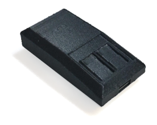

# Charlie's auto-mouse

Avoid computer or activity lock producing mouse or keyboard movements.

Requires a RP2040 board.

Works very nice with boards with two buttons and RGB activity LEDs.

[@carlesoriol](carles@enging.com) - Carles Oriol

## Use

Connect the device to USB and it will start generating activities periodically.

Select activity with BOOT button.

| Color | Device | Activity |
| - | - | - |
| OFF | | Auto mouse generates no actions. |
| | | |
| Blue | Mouse | Circles |
| Pink | Mouse | Long diagonal lines |
| White | Mouse | Very short diagonal lines |
| Red | Mouse | Random 2 phase movement |
| | | |
| Green | Keyboard | Volume + -> Volume - |
| Yellow | Keyboard | Space key |

Every change in the setup is stored automatically in "EEPROM" so it becomes the new default.

## Pi Pico W

With Pico W, Bluetooth capabilities can be used to generate mouse movement.
Just pair it and will work as any other mouse.

Bluetooth in this 

## 2nd button

2nd button can be used to change the elapsed time between activities.

pin: 24

| Blink | Time |
| - | - |
| 1 | 15 seconds |
| 2 |  1 minute |
| 3 | 5 minutes |

## RGB color led 

RGB color led requires a WS2812 BGR *(yes, BGR)* connected to pin 23.

Source code

Use Arduino RP2040 to compile the source.

https://www.github.com/carlesoriol/auto_mouse

## Case

Model for Pi PICO W & RP2040 16Mb RGB LED look like an old Genius mouse.

Model for RP2040 16Mb RGB board requires to be printed with 105% size.

